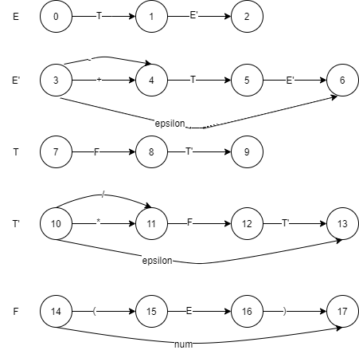
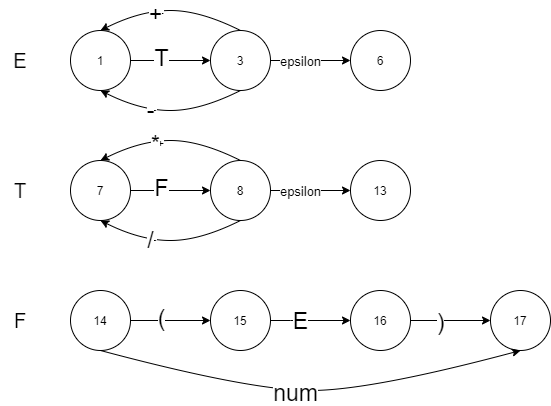
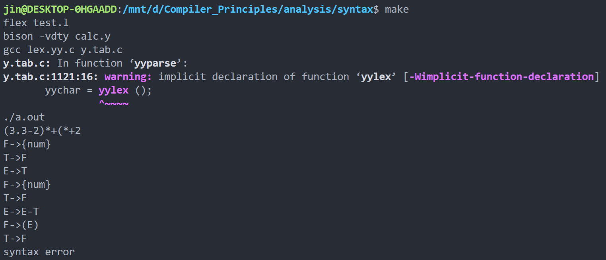
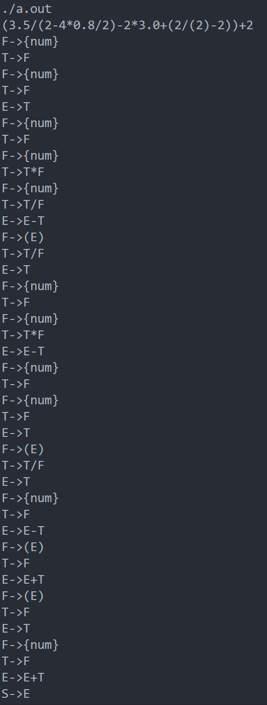

# 语法分析程序的设计与实现实验报告
**2018211302班 金浩男 2018211121**
## 实验目的
编写语法分析程序，实现对算术表达式的语法分析。要求所分析算数表达式由如下的文法产生。
$$E \rightarrow E+T | E–T | T\\
T\rightarrow T*F | T/F | F\\
F\rightarrow (E) | num$$

在对输入的算术表达式进行分析的过程中，依次输出所采用的产生式。
## 实验报告内容
- 递归下降分析方法
- **LL(1)** 文法
- **LR(1)** 文法
- **YACC && LEX**

## 实验环境
**Windows10**

**Visual Studio Code**

**CMake 3.19.0-rc1**

**MinGW g++ 8.1.0**
## 文件输入
**grammar.txt**
```
E -> E + T | E - T | T
T -> T * F | T / F | F
F -> ( E ) | num
```
**input.txt**
```
//1
(3.3 - 2) * + ( * + 2
//2
(3.5/(2-4*.8/2)-2*3.+(2/(2)-2))+2
```
## 算法设计

- 读入算数表达式
- 处理算法表达式
- 递归下降分析
  - 直接根据流程图处理算数表达式
- 读入文法
- 初步处理文法
- **LL(1)** 文法
  - 按文法的拓扑序对非终结符排序
  - 消除直接左递归和间接左递归
  - 提取左公因子
  - 构造 **LL(1)** 分析表
  - 根据分析表预测分析算法表达式，并做出相应的错误处理
- **LR(1)** 文法
  - 拓广文法
  - 构造识别该文法所有活前缀的 **DFA**
  - 构造 **LR(1)** 分析表
  - 根据分析表预测分析算法表达式

## 构架设计

### LexicalAnaysis 
主要函数成员：
- *LexicalAnaysis(ifstream fin)* ：输出算法表达式
- *solve()* ：处理算法表达式
- *printToken()* ：输出*token*集，用于后续处理
  

主要数据成员：
- *tokenTable* ：*token*集

### Grammar
主要函数成员:
- *Grammar(ifstream& fin)* ：输入文法，初步处理文法
- *eliminateLeftRecursion()* ：消除左递归
- *eliminateLeftCommonFactor()* ：提取左公因子
- *getFirst()* ：求单个文法符号的*First*集
- *getFollow()* ：求单个文法符号的*Follow*集
- *findFirst()* ：求一串文法符号的*First*集
- *printRule()* : 输出文法处理后的结果
  

主要数据成员：
- *startSymbol* ：起始非终结符
- *nonTerminals* ：非终结符集
- *terminalSymbols* ：终结符集
- *rules* ：产生式集
- *first* ：*First*集
- *follow* ：*Follow*集
  
### LL1:Grammar
主要函数成员：
- *work()* ：处理文法
- *getTable()* ：构造分析表
- *printTable(ofstream fout)* ：输出分析表
- *solve(vector<pair<string,string>> token, ofstream fout)* ：根据分析表预测分析算数表达式

主要数据成员：
- *table* ：分析表
  
### LR1:Grammar
主要函数成员：
- *work()* ：处理文法
- *addStart()* ：拓广文法
- *getTable()* ：构造分析表
- *printTable(ofstream)* ：输出分析表
- *printDFA(ofstream)* ：输出项目集规范族
- *solve(vector<pair<string,string>> token, ofstream fout)* ：根据分析表预测分析算数表达式

主要数据成员：
- *table* ：分析表
- *itemSets* ：项目集

### Recursive
主要函数成员：
- *solve(vector<pair<string,string>> token, ofstream fout)* ：递归下降分析算数表达式
- *proE()*
- *proT()*
- *proF()*

主要数据成员：
- *p* ：当前的算术表达式的指针

## 文件输入输出

### 输入输出格式**main.cpp**
输入四个参数，分别代表文法的输入文件，要求识别的算法表达式的文件，输出的文件，以及采用的方法：

- -recursive 递归下降分析方法
- -LL1 LL（1）文法
- -LR1 LR（1）文法
```c++
try {
    if (argc < 4)
        throw std::runtime_error("Too few arguments");
    std::ifstream finGrammar(argv[1]);
    std::ifstream fin(argv[2]);
    std::ofstream fout(argv[3]);
    if (!finGrammar.is_open())
        throw std::runtime_error(argv[1] + std::string(" is unable to open."));
    if (!fin.is_open())
        throw std::runtime_error(argv[2] + std::string(" is unable to open."));
    LexicalAnalysis lex(fin);
    lex.LexicalAnalysis::solve();
    if (!strcmp(argv[4], "-LL1")) {
        LL1 LL1Grammar(finGrammar);
        LL1Grammar.LL1::work();
        LL1Grammar.LL1::printRule(fout);
        LL1Grammar.LL1::printTable(fout);
        LL1Grammar.LL1::solve(lex.LexicalAnalysis::getTokenTable(), fout);
    } else if (!strcmp(argv[4], "-LR1")) {
        LR1 LR1Grammar(finGrammar);
        LR1Grammar.LR1::work();
        LR1Grammar.LR1::printRule(fout);
        LR1Grammar.LR1::printDFA(fout);
        LR1Grammar.LR1::printTable(fout);
        LR1Grammar.LR1::solve(lex.LexicalAnalysis::getTokenTable(), fout);
    } else if (!strcmp(argv[4], "-recursive")) {
        recursive RE(fout);
        RE.recursive::solve(lex.LexicalAnalysis::getTokenTable());
    } else
        throw std::runtime_error("parameter error");
    finGrammar.close();
    fin.close();
    fout.close();
} catch (const std::exception& e) {
    std::cout << e.what() << '\n';
}
```

### 文法输入文件**grammar.txt**
```
E -> E + T | E - T | T
T -> T * F | T / F | F
F -> ( E ) | num
```

### 算法表达式输入文件**input.txt**
```
//1
(3.3 - 2) * + ( * + 2
//2
(3.5/(2-4*.8/2)-2*3.+(2/(2)-2))+2
```

## 表达式处理**lexical.h lexical.cpp**

沿用之前语法分析的代码，之前是写在一个**cpp**里面的，这次分成了**h**和**cpp**。

虽然这次只要分析算法表达式，但是代码保留了其他内容。

**lexical.cpp**生成了*tokenTable*，是算法表达式的*token*集；格式 *<string,string>*，分别代表类型和内容。

在这个算法表达式中，类型有`operator`和`number`

- `operator`：内容有`(` `)` `+` `-` `*` `/`
- `number`：内容就是数字，对应文法中的`num`
  

为了分割多个表达式，我用`//`分割一行，在**lexical.cpp**中，会把`//`之后的内容识别为注释，在这里我每出现一次`//`，就在*tokenTable*中添加一个分隔符`SPLIT`，用来分割多个表达式。

## 递归下降分析方法**recursive.h recursive.cpp**

### 消除左递归
$$
E \rightarrow T E' \\
E' \rightarrow + T E' | - T E' | \epsilon \\
T \rightarrow F T' \\
T' \rightarrow * F T' | / F T' | \epsilon \\
F \rightarrow ( E ) | num
$$

### 流程图



化简后



### 算法分析
直接根据化简后的流程图写出代码。

*proE()*、*proT()* 和 *proF()* 分别代表三句文法的执行过程。

### 主要代码

```c++
void recursive::proE() {
    fout << "E: ";
    currentInput();
    proT();
    if (p->second == "+" || p->second == "-") {
        ++p;
        proE();
    } else if (p->second == "$")
        accept();
}
void recursive::proT() {
    fout << "T: ";
    currentInput();
    proF();
    if (p->second == "*" || p->second == "/") {
        ++p;
        proT();
    } else if (p->second == "$")
        accept();
}
void recursive::proF() {
    fout << "F: ";
    currentInput();
    if (p->second == "(") {
        ++p;
        proE();
        if (p->second == ")")
            ++p;
        else
            error();
    } else if (p->first == "number")
        ++p;
    else
        error();
    if (p->second == "$")
        accept();
}
```
### 文件输出
终端输入
```
./syntax grammar.txt input.txt output0.txt -recursive
```
结果见附件 **output0.txt** 
## 文法的处理 **grammar.h grammar.cpp**

### 读入和初步处理文法
- 用匿名函数 *split()* 分割输入数据
- 先按照`->`分割，得到产生式的左部
- 再按照`|`分割产生式的右部
- 再按照空格分割
- 最后得到产生式集 *token*
```c++
Grammar::Grammar(std::ifstream& fin) {
    std::string s;
    auto split = [](std::string& s, const std::string& pattern) -> std::string {
        std::string res;
        size_t pos = 0;
        if ((pos = s.find(pattern)) != std::string::npos) {
            res = s.substr(0, pos);
            while (res.back() == ' ')
                res.pop_back();
            pos += pattern.size();
            while (s[pos] == ' ')
                ++pos;
            s.erase(0, pos);
            return res;
        } else {
            res = s;
            s = "";
            return res;
        }
    };
    unsigned int row = 0;
    while (getline(fin, s)) {
        if (s.empty())
            continue;
        ++row;
        auto nonTerminal = split(s, "->");
        if (nonTerminal.find(' ') != std::string::npos)
            throw std::runtime_error("Row " + std::to_string(row) + ": Too much symbols in the left of rule in line.");
        if (s.empty())
            throw std::runtime_error("Row " + std::to_string(row) + " Illegal production rule in line.");
        if (row == 1)
            startSymbol = nonTerminal;
        nonTerminalSymbols.emplace(nonTerminal);
        while (!s.empty()) {
            auto ss = split(s, "|");
            std::vector<std::string> statements;
            while (!ss.empty()) {
                auto symbol = split(ss, " ");
                if (!symbol.empty())
                    statements.emplace_back(symbol);
            }
            rules[nonTerminal].emplace_back(statements);
        }
    }
}
```

### 消除左递归
- 用匿名函数*topoSort*，对非终结符排序，方便消除间接左递归时的带入，以可防止出现
  $$F\rightarrow (E)|num\\
 T\rightarrow (E)T'|numT'$$

- 消除左递归
  - 找到间接左递归
    - 枚举产生式$i=1\rightarrow n$
    - 得到当前表达式$A\rightarrow B\alpha$
    - 枚举另一个表达式$j=1\rightarrow i-1$
    - 找到一个产生式左部与当前产生式右部第一个符号相同的，形如$B\rightarrow A\beta$
    - 将$B\rightarrow A\beta$带入 $A$
    - 得到 $A \rightarrow A\beta \alpha$
    - 这样就把一个间接左递归变成了直接左递归
  - 消除直接左递归
    - 当前产生式形如$A \rightarrow A \alpha|\beta$
    - 删除当前产生式
    - 构造新的左部的产生式$A' \rightarrow \alpha A'|\epsilon$
    - 再在当前左部为$A$产生式的尾部插入$A\rightarrow \beta A'$
```c++
void Grammar::eliminateLeftRecursion() {
    auto topoSort = [&](const std::string& startSymbol) -> std::vector<std::string> {
        std::vector<std::string> res{ startSymbol };
        size_t i = 0;
        bool flag = true;
        while (flag) {
            flag = false;
            size_t size = rules.size();
            for (; i < size; ++i)
                for (const auto& [lhs, rhs] : rules) {
                    if (lhs != res[i])
                        continue;
                    for (const auto& statement : rhs)
                        for (const auto& symbol : statement) {
                            bool has = true;
                            if (isTerminal(symbol))
                                has = false;
                            for (size_t j = 0; has && j < res.size(); ++j)
                                if (symbol == res[j])
                                    has = false;
                            if (has)
                                res.emplace_back(symbol);
                        }
                }
            if (size < rules.size())
                flag = true;
        }
        return res;
    };
    std::vector<std::string> nonTerminal = topoSort(startSymbol);
    for (const auto& symbolA : nonTerminal) {
        for (const auto& symbolB : nonTerminal) {
            if (symbolA == symbolB)
                break;
            std::vector<std::vector<std::string>> tmp;
            for (auto statementA = rules[symbolA].begin(); statementA != rules[symbolA].end();) {
                if (statementA->front() != symbolB) {
                    ++statementA;
                    continue;
                }

                for (const auto& statementB : rules[symbolB]) {
                    std::vector<std::string> statementA_ = statementB;
                    for (size_t i = 1; i < statementA->size(); ++i)
                        statementA_.emplace_back((*statementA)[i]);
                    tmp.emplace_back(statementA_);
                }
                statementA = rules[symbolA].erase(statementA);
            }
            for (const auto& statement : tmp)
                rules[symbolA].emplace_back(statement);
        }
        auto isLeftRecursion = [this](const std::string& symbol) -> bool {
            for (const auto& statement : rules[symbol])
                if (statement.front() == symbol)
                    return true;
            return false;
        };
        if (isLeftRecursion(symbolA)) {
            auto symbolA_ = symbolA + "'";
            for (auto statementA = rules[symbolA].begin(); statementA != rules[symbolA].end();) {
                if (statementA->front() != symbolA) {
                    ++statementA;
                    continue;
                }
                statementA->erase(statementA->begin());
                statementA->emplace_back(symbolA_);
                rules[symbolA_].emplace_back(*statementA);
                statementA = rules[symbolA].erase(statementA);
            }
            for (auto& statementA : rules[symbolA])
                statementA.emplace_back(symbolA_);
            rules[symbolA_].emplace_back(std::vector<std::string>{ epsilon });
        }
    }
}
```
### 提取左公因子

- 提取左公因子
  - 枚举所有产生式$i=1\righta n$
  - 对于当前产生式$A\rightarrow B\alpha | B \beta$的公共前缀
  - 删除当前产生式
  - 构造新的左部的产生式$A' \rightarrow \alpha |\beta$
  - 插入$A\rightarrow BA'$
  - 一直循环，直至没有新的提取左公因子的操作
```c++
void Grammar::eliminateLeftCommonFactor() {
    bool flag = true;
    while (flag) {
        flag = false;
        for (auto& [symbolA, ruleA] : rules) {
            std::unordered_set<std::string> Set;
            std::string commonSymbol;
            for (const auto& statementA : ruleA) {
                const auto& symbol = statementA.front();
                if (symbol == epsilon)
                    continue;
                if (Set.find(symbol) != Set.end()) {
                    commonSymbol = symbol;
                    break;
                }
                Set.emplace(symbol);
            }
            if (commonSymbol.empty())
                continue;
            auto symbolA_ = symbolA + "'";
            bool hasEpsilon = false;
            for (auto statementA = ruleA.begin(); statementA != ruleA.end();) {
                if (statementA->front() != commonSymbol) {
                    ++statementA;
                    continue;
                }
                statementA->erase(statementA->begin());
                if (statementA->empty())
                    hasEpsilon = true;
                else
                    rules[symbolA_].emplace_back(*statementA);
                statementA = ruleA.erase(statementA);
            }
            if (hasEpsilon)
                rules[symbolA_].emplace_back(std::vector<std::string>{ epsilon });
            ruleA.emplace_back(std::vector<std::string>{ commonSymbol, symbolA_ });
            flag = true;
            break;
        }
    }
}
```

### 求 **First** 集
- 求 **First**集
  - 终结符和$\epsilon$放入自身的 **First** 集 
  - 枚举所有产生式，对于当前产生式的左部$A$，枚举每个右部
    - 如果当前右部的第一个符号$B$是非终结符或是$\epsilon$，则$first[A]+=\{B\}$
    - 否则，$first[A]+=first[B]-\{\epsilon\}$
    - 如果$\epsilon \in first[B]$，则对于下一个符号$C$进行和$B$一样的处理
  - 一直循环，直至 **First** 集没有增加
```c++
void Grammar::getFirst() {
    for (const auto& symbol : terminalSymbols)
        first[symbol].emplace(symbol);
    first[epsilon].emplace(epsilon);
    bool flag = true;
    while (flag) {
        flag = false;
        for (const auto& rule : rules) {
            auto symbolA = rule.first;
            auto ruleA = rule.second;
            size_t size = first[symbolA].size();
            auto putFirst = [&](const std::string& symbolA, const std::string& symbolB) -> void {
                for (const auto& symbol : first[symbolB])
                    if (symbol != epsilon)
                        first[symbolA].emplace(symbol);
            };
            std::function<void(std::vector<std::string>::iterator, std::vector<std::string>::iterator)> putStatement = [&](std::vector<std::string>::iterator symbol, std::vector<std::string>::iterator end) -> void {
                if (symbol == end) {
                    first[symbolA].emplace(epsilon);
                    return;
                }
                std::string symbolB = *symbol;
                if (symbolB == epsilon) {
                    first[symbolA].emplace(epsilon);
                } else if (isTerminal(symbolB)) {
                    first[symbolA].emplace(symbolB);
                } else {
                    putFirst(symbolA, symbolB);
                    if (first[symbolB].find(epsilon) != first[symbolB].end()) {
                        ++symbol;
                        putStatement(symbol, end);
                    }
                }
            };
            for (auto& statementA : ruleA)
                putStatement(statementA.begin(), statementA.end());
            if (first[symbolA].size() > size)
                flag = true;
        }
    }
}
```

### 求 **Follow** 集
A->BCDEF
- 求 **Follow** 集
  - 在起始非终结符的 **Follow** 集中放入`$`
  - 枚举所有产生式
    - 倒着枚举当前产生式的所有符号，产生式左部$A$，当前符号$B$是非终结符，下一个符号$C$
    - *flag1*记录当前后缀的 **First** 集中是否有$\epsilon$
    - $follow[B]+=first[C]-\{\epsilon\}$
    - 根据$C=\epsilon$或$\epsilon \in first[C]$，更新*flag1*
    - *flag1*为真，$follow[B]+=follow[A]$
  - 一直循环，直至 **Follow** 集没有增加
  
```c++
void Grammar::getFollow() {
    follow[startSymbol].emplace(dollar);
    bool flag = true;
    while (flag) {
        flag = false;
        for (const auto& rule : rules) {
            auto symbolA = rule.first;
            auto ruleA = rule.second;
            auto putFirst = [&](const std::string& symbolA, const std::string& symbolB) -> void {
                for (const auto& symbol : first[symbolB])
                    if (symbol != epsilon)
                        follow[symbolA].emplace(symbol);
            };
            auto putFollow = [&](const std::string& symbolA, const std::string& symbolB) -> void {
                for (const auto& symbol : follow[symbolB])
                    follow[symbolA].emplace(symbol);
            };
            auto hasEpsilon = [&](const std::string& symbol) -> bool {
                return symbol == epsilon || first[symbol].find(epsilon) != first[symbol].end();
            };
            for (const auto& statementA : ruleA) {
                putFollow(statementA.back(), symbolA);
                bool flag1 = true;
                for (int i = statementA.size() - 2; i >= 0; --i) {
                    auto symbolB = statementA[i];
                    auto symbolC = statementA[i + 1];
                    size_t size = follow[symbolB].size();
                    if (!isTerminal(symbolB)) {
                        putFirst(symbolB, symbolC);
                        flag1 &= hasEpsilon(symbolC);
                        if (flag1)
                            putFollow(symbolB, symbolA);
                    }
                    if (follow[symbolB].size() > size)
                        flag = true;
                }
            }
        }
    }
}
```

## **LL(1)** 文法 **LL1.h LL1.cpp**

### 读入文法
继承 **Grammar**

### 处理文法
- 消除左递归
- 提取左公因子
- 求 **First** 集
- 求 **Follow** 集

以上函数都继承 **Grammar**
```c++
void LL1::work() {
    eliminateLeftRecursion();
    eliminateLeftCommonFactor();
    getSymbols();
    getFirst();
    getFollow();
    getTable();
}
```

### 构造分析表
- 生成分析表
  - 遍历每一个生成式，$A\rightarrow B$
  - 根据每个符号的 **First** 集，求得生成式右部的 **First** 集$\_ first$
  - $\forall C \in \_ first ,C\ne \epsilon ,table[A][C]=B$
  - 如果$\epsilon \in \_first$
  - $\forall C \in follow[A] , table[A][C]=B$
- 错误处理
  - 遍历所有的非终结符$A$
  - 如果$\forall C \in follow[A] , table[A][C]$为空
  - $table[A][C]=synch$
  
```c++
void LL1::getTable() {
    for (const auto& rule : rules) {
        std::string nonTerminal = rule.first;
        row.emplace(nonTerminal);
        for (const auto& statement : rule.second) {
            auto _first = findFirst(statement);
            bool flag = false;
            for (const auto& symbol : _first) {
                if (symbol == epsilon)
                    flag = true;
                else {
                    table[nonTerminal][symbol] = statement;
                    column.emplace(symbol);
                }
            }
            if (flag) {
                auto& _follow = follow[nonTerminal];
                for (const auto& symbol : _follow) {
                    table[nonTerminal][symbol] = statement;
                    column.emplace(symbol);
                }
            }
        }
    }
    for (const auto& nonTerminal : row) {
        const auto& _follow = follow[nonTerminal];
        for (const auto& symbol : _follow) {
            if (table.find(nonTerminal) == table.end() || table[nonTerminal].find(symbol) == table[nonTerminal].end()) {
                column.emplace(symbol);
                table[nonTerminal][symbol] = synch;
            }
        }
    }
}
```
### 根据分析表预测分析算术表达式
- **LexicalAnaysis**模块生成的*token*集，用`SPLIT`分割成多个算数表达式，放入*input*中

- 栈中压入`$`和起始非终结符*startSymbol*
  - 读取栈顶符号`A`，和当前*input*最左端符号`B`
  - 如果`A`是终结符且`A`=`B`
  - 则弹出栈顶`A`，并读入`B`
  - 否则弹出栈顶`A`，并输出错误信息
  - 如果`A`是非终结符
  - 查询*table[A][B]*
  - 如果为空，输出错误信息，并忽略`B`
  - 如果*table[A][B]*=`synch`
  - 弹出栈顶`A`，并输出错误信息
  - 否则弹出栈顶`A`，并倒着压入对应的表达式
  - 一直循环，直到栈中剩下`$`，表示成功接收算数表达式
```c++
void LL1::solve(const std::vector<std::pair<std::string, std::string>>& token, std::ofstream& fout) {
    fout << "Process:\n";
    const int len = 35;
    for (size_t left = 0; left < token.size(); ++left) {
        size_t right = left;
        for (; right < token.size(); ++right)
            if (token[right].first == "SPLIT")
                break;
        if (left == right)
            continue;
        fout << "Parse  ";
        static std::pair<std::string, std::string> input[100000];
        static std::string statement[100000];
        int cur1 = 0, cur2 = 0;
        for (size_t i = left; i < right; ++i) {
            fout << token[i].second;
            input[cur1++] = token[i];
        }
        fout << "  :\n";
        input[cur1++] = std::make_pair("ACC", "$");
        statement[cur2++] = "$";
        statement[cur2++] = startSymbol;
        auto p1 = &input[0];
        auto p2 = &statement[cur2 - 1];
        do {
            std::string out = "";
            for (int i = 0; i < cur2; ++i)
                out += statement[i];
            fout << out << std::setw(len - out.size()) << std::setfill(' ') << '|';
            out = "";
            for (int i = p1 - &input[0]; i < cur1; ++i)
                out += input[i].second;
            fout << std::setw(len) << std::setfill(' ') << out << '|';
            out = "";
            if (isTerminal(*p2) || *p2 == "$") {
                if (compare(*p2, *p1)) {
                    --p2;
                    --cur2;
                    ++p1;
                } else {
                    out = "ERROR: pop " + *p2;
                    --p2;
                    --cur2;
                }
            } else {
                std::string symbol = p1->first == "number" ? "num" : p1->second;
                if (table.find(*p2) != table.end() && table[*p2].find(symbol) != table[*p2].end()) {
                    auto rule = table[*p2][symbol];
                    if (rule.front() == "synch") {
                        out = "ERROR: pop " + *p2;
                        --p2;
                        --cur2;
                    } else {
                        out = *p2 + "->";
                        for (const auto& symbol_ : rule)
                            out += symbol_;
                        --cur2;
                        --p2;
                        if (rule.front() != epsilon)
                            for (int i = (int)rule.size() - 1; i >= 0; --i) {
                                statement[cur2++] = rule[i];
                                ++p2;
                            }
                    }
                } else {
                    out = "ERROR: skip " + p1->second;
                    ++p1;
                }
            }
            fout << out << std::setw(len - out.size()) << std::setfill(' ') << '\n';
        } while (*p2 != "$" && (p1 - &input[0] != cur1));
        if (*p2 == "$" && p1->second == "$") {
            fout << "$" << std::setw(len - 1) << std::setfill(' ') << '|';
            fout << std::setw(len) << std::setfill(' ') << "$" << '|';
            fout << "ACCEPT" << std::setw(len - 6) << std::setfill(' ') << '\n';
        }
        left = right;
        fout << '\n';
    }
}
```
### 文件输出
终端输入
```
./syntax grammar.txt input.txt output1.txt -LL1
```
结果见**output1.txt**


## **LR(1)** 文法 **LR1.h LR1.cpp**
### 读入文法
继承 **Grammar**

### 处理文法
- 拓广文法
- 求 **First** 集

以上函数都继承 **Grammar**
```c++
void LR1::work() {
    addStart();
    getSymbols();
    getFirst();
    getTable();
}
```

### 构造项目集闭包
*getClosure*为匿名函数，在*getTable*函数中
- 构造项目集闭包
  - 遍历项目集中的项目
    - 如果当前项目是规约项目，则跳过
    - 当前项目形如$A\rightarrow\alpha \cdot B \beta,a$
    - 如果`B`是终结符，则跳过
    - 否则求$\beta$的**First**集，得到`_first`
    - 如果$\epsilon \in \_first$，则删除 $\epsilon$，加入当前项目的`lookahead`
    - 遍历产生式，遍历`_first`集
        - 构建新的项目并加入闭包
  - 一直循环，直到闭包不再增大
```c++
auto getClosure = [&](itemSet& cur) -> void {
    bool flag = true;
    while (flag) {
        flag = false;
        for (const auto& _item : cur) {
            if (_item.dotPos == _item.statement.size())
                continue;
            const std::string& next = _item.statement[_item.dotPos];
            if (isTerminal(next))
                continue;
            std::vector<std::string> statement;
            for (size_t pos = _item.dotPos + 1; pos != _item.statement.size(); ++pos)
                statement.emplace_back(_item.statement[pos]);
            auto _first = findFirst(statement);
            if (_first.find(epsilon) != _first.end()) {
                _first.erase(epsilon);
                _first.emplace(_item.lookahead);
            }
            for (const auto& rule : rules[next])
                for (const auto& lookahead : _first) {
                    item newItem(next, rule, lookahead, 0);
                    if (cur.find(newItem) == cur.end()) {
                        cur.emplace(newItem);
                        flag = true;
                    }
                }
        }
    }
};
```
### 构造分析表
- 建立项目集规范族，生成分析表
    - 生成由拓广符号和`$`构成的的闭包，并加入规范族
    - 遍历项目集，遍历每个文法符号*symbol*
      - 将`·`后移，用匿名函数*run*构建新项目集
      - 如果新项目集非空，且不在规范族中
      - 将新项目集加入规范族
      - 如果*symbol*为终结符或`$`
      - 将`shift`填入分析表`action`的对应位置
      - 否则，填入分析表`goto`
    - 遍历当前项目集的每个项目
      - 找到归约项目，将`reduce`填入分析表
    - 一直循环，直至规范族不再增大

```c++
void LR1::getTable() {
    
    itemSet startItemSet;
    startItemSet.emplace(item(startSymbol, rules[startSymbol].front(), dollar, 0));
    getClosure(startItemSet);
    itemSets.emplace_back(startItemSet);

    auto run = [&](const itemSet& cur, const std::string& symbol) -> int {
        itemSet newItemSet;
        for (const auto& _item : cur) {
            if (_item.dotPos == _item.statement.size())
                continue;
            const std::string& next = _item.statement[_item.dotPos];
            if (next == symbol) {
                item newItem(_item);
                ++newItem.dotPos;
                newItemSet.emplace(newItem);
            }
        }
        getClosure(newItemSet);
        if (newItemSet.empty())
            return -1;
        for (size_t i = 0; i < itemSets.size(); ++i) {
            if (itemSets[i] == newItemSet)
                return i;
        }
        itemSets.emplace_back(std::move(newItemSet));
        return itemSets.size() - 1;
    };
    for (size_t i = 0; i < itemSets.size(); ++i) {
        for (const auto& symbol : nonTerminalSymbols) {
            int go = run(itemSets[i], symbol);
            if (go > 0) {
                table[i][symbol] = std::make_pair(Action::SHIFT, go);
                goTo.emplace(symbol);
            }
        }
        for (const auto& symbol : terminalSymbols) {
            int go = run(itemSets[i], symbol);
            if (go > 0) {
                table[i][symbol] = std::make_pair(Action::SHIFT, go);
                action.emplace(symbol);
            }
        }
        for (const auto& _item : itemSets[i])
            if (_item.dotPos == _item.statement.size()) {
                if (_item.nonTerminal == startSymbol)
                    table[i][_item.lookahead] = std::make_pair(Action::ACCEPT, 0);
                else
                    table[i][_item.lookahead] = std::make_pair(Action::REDUCE, 0);
                action.emplace(_item.lookahead);
            }
    }
}
```

### 根据分析表预测分析算术表达式
同 **LL(1)** 文法，按照分析表做出对应的动作
```c++
void LR1::solve(const std::vector<std::pair<std::string, std::string>>& token, std::ofstream& fout) {
    fout << "Process:\n";
    const int len = 35;
    for (size_t left = 0; left < token.size(); ++left) {
        size_t right = left;
        for (; right < token.size(); ++right)
            if (token[right].first == "SPLIT")
                break;
        if (left == right)
            continue;
        fout << "Parse  ";
        static std::pair<std::string, std::string> input[100000];
        static std::pair<int, std::string> status[100000];
        int cur1 = 0, cur2 = 0;
        for (size_t i = left; i < right; ++i) {
            fout << token[i].second;
            input[cur1++] = token[i];
        }
        fout << "  :\n";
        input[cur1++] = std::make_pair("ACC", "$");
        status[cur2++] = std::make_pair(0, "$");
        auto p1 = &input[0];
        auto p2 = &status[cur2 - 1];
        for (;;) {
            std::string out = "";
            for (int i = 0; i < cur2; ++i)
                out += status[i].second + std::to_string(status[i].first);
            fout << out << std::setw(len - out.size()) << std::setfill(' ') << '|';
            out = "";
            for (int i = p1 - &input[0]; i < cur1; ++i)
                out += input[i].second;
            fout << std::setw(len) << std::setfill(' ') << out << '|';
            out = "";

            std::string symbol;
            if (p1->first == "number")
                symbol = "num";
            else if (p1->first == "operator" || p1->first == "ACC")
                symbol = p1->second;
            if (table[p2->first].find(symbol) == table[p2->first].end()) {
                out = ("'" + symbol + "'" + " is missmatching.");
                fout << out << std::setw(len - out.size()) << std::setfill(' ') << '\n';
                break;
            }
            auto action = table[p2->first][symbol];
            if (action.first == Action::SHIFT) {
                out = "shift " + std::to_string(action.second);
                status[cur2++] = std::make_pair(action.second, symbol);
                ++p2;
                ++p1;
            } else if (action.first == Action::REDUCE) {

                out = "reduce by ";
                std::string nonTerminal;
                int cnt = 0;
                for (const auto& _item : itemSets[p2->first]) {
                    if (_item.dotPos != _item.statement.size())
                        continue;
                    nonTerminal = _item.nonTerminal;
                    out += _item.nonTerminal + "->";
                    for (const auto& symbol : _item.statement) {
                        out += symbol;
                        ++cnt;
                    }
                    break;
                }
                while (cnt--) {
                    --cur2;
                    --p2;
                }
                auto goTo = table[p2->first][nonTerminal];
                status[cur2++] = std::make_pair(goTo.second, nonTerminal);
                ++p2;
            } else {
                out = "accept";
            }
            fout << out << std::setw(len - out.size()) << std::setfill(' ') << '\n';
            if (out == "accept")
                break;
        }
        fout << '\n';
        left = right;
    }
}
```

### 文件输出
终端输入
```
./syntax grammar.txt input.txt output2.txt -LR1
```
结果见**output2.txt**


## **YACC && LEX**
在*UNIX*环境下，使用`lex`和`yacc`。

在*windows10*和*linux*下，都是使用`flex`和`bison`。

经测试，在*windows*下`bison`会出现错误，所以换一下测试环境。

### 测试环境
**Windows Subsystem for Linux**      

**Ubuntu 18.04.3 LTS**

**gcc version 7.4.0** 

### 代码

**test.l**
```c
%{
#include "y.tab.h"
%}
D               [0-9]
number          {D}+(\.{D}+)?
%%
{number}        { return T_NUM; }
[-/+*()\n]      { return yytext[0]; }
.               { return 0; }
%%

int yywrap(void) { 
    return 1;
}
```

**calc.y**
```c
%{
#include <stdio.h>
void yyerror(const char* msg);
#define YYSTYPE double
%}

%token T_NUM

%left '+' '-'
%left '*' '/'

%%

S   :   E '\n'          { printf("S->E\n");}
    |   /* empty */     { /* empty */ }
    ;

E   :   E '+' T         { printf("E->E+T\n");}
    |   E '-' T         { printf("E->E-T\n");}
	|   T               { printf("E->T\n");}
    ;
T   :   T '*' F         {  printf("T->T*F\n");}
	|   T '/' F         { printf("T->T/F\n");}
	|   F               { printf("T->F\n");}
	;

F   :   '(' E ')'       { printf("F->(E)\n");}
	|   T_NUM           { printf("F->{num}\n");}
	;
%%

void yyerror(const char* msg){
	puts(msg);
}
int main() {
    return yyparse();
}
```
### 输入输出

